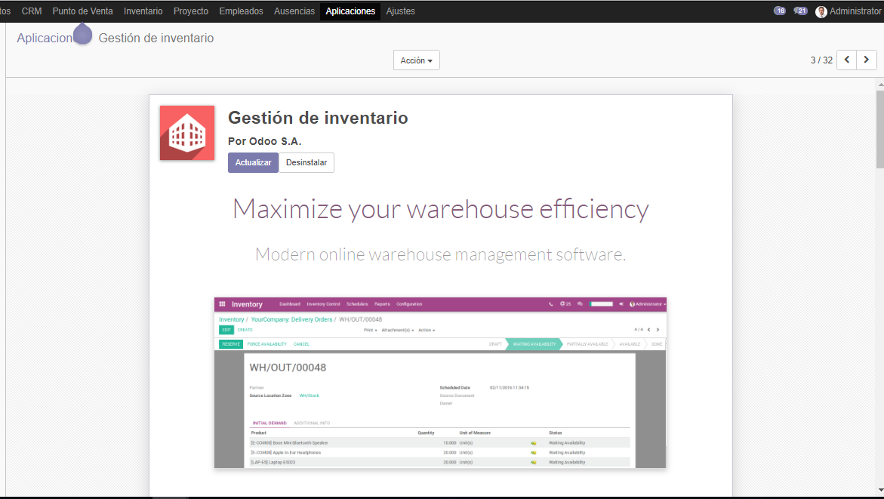
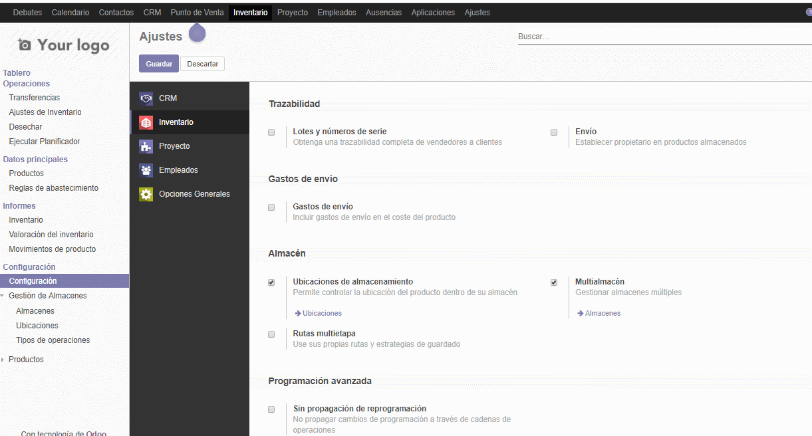

# Lab. 4: Modulo Logistico

## Desarrollo

1.2. Instalacion del modulo **Inventarios**


1.2. Vista del modulo **Inventarios**


1.2. En el menu de configuraciones, activamos la opcion  **Multialmacen** y guardamos, con esto podemos ver la opcion para poder añadir mas almacenes


2.3. Se navega a la dirección: [http://localhost:3000](http://localhost:3000)


2.4. Así mismo, se inicia con éxito el servicio **Expo** de ejemplo con el siguiente comando:
```bash
expo init
```

3.5. Se modificó la línea de código indicada:
```jsx
const MiComponente = (props) => {
	return (<span>Hola Mundo</span>);
}
```

4.5. Se muestra el funcionamiento de la app.


## Tarea

- Se completó el desarrollo del laboratorio.

## Conclusiones

- **React JS** es una librería basada en componentes que nos ayuda a tener un desarrollo __ágil y completo__
- Para instalar el cliente oficial de React, basta el comando:
```
npm install --global react-cli
```
- Dentro de nuestra carpeta **src** se encontrarán todos nuestros archivos.
- Se adjunta el enlace para documentación básica de Markdown [https://guides.github.com/pdfs/markdown-cheatsheet-online.pdf](https://guides.github.com/pdfs/markdown-cheatsheet-online.pdf)