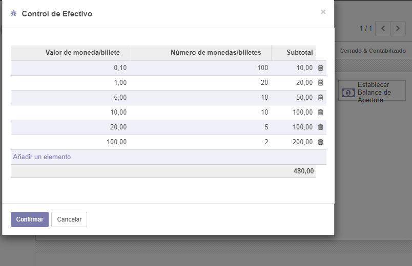

# Lab 7

## Desarrollo

1Interfaz del punto de venta

2Agregando cliente

3Seleccionando cliente

4Interfaz de pago

5Imprimiendo recibo

6Control de sesion

7Metodos de pago

8Agregando saldo de apertura

9Mostrando saldo diario

11Realizando el pago de diferentes formas

12Agregando PIN al administrador

13Agregando empleado Cajero

14PIN de acceso

15Categoria de producto

16Agregando imagen a la categoria

17Clasificacion de los productos

18Cierre validado retirando dinero

19Cafeteria realizando cobros,tranpaso de mesa.

20Anilitando recibo

21Separacion de cuenta

## Conclusiones

- Los punto de venta tienen diferentes formas de pago, y todas estas se pueden verificar con un correo electronico
- Vimos las herramientas y opciones que nos ofrece el modulo punto de venta, y gracias a esto podemos adaptarlo a diferentes negocios.
- ODOO permite tener gestios de todos los empleados y tambien controlar los permisos que tiene cada susodicho.
- El tema de la asignacion de PIN a los usuarios con privilegios es muy importante, ya que estos tienen la facilidad de agregar modificar y eliminar los precios.
- El modulo punto de venta nos da una gran cantidad de herramnientas en el tema de administracion de dinero

