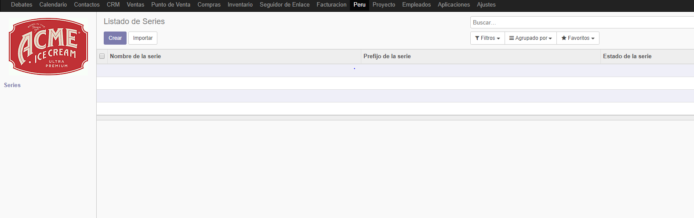
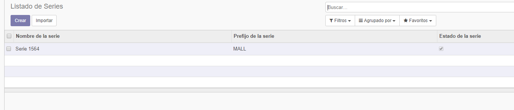
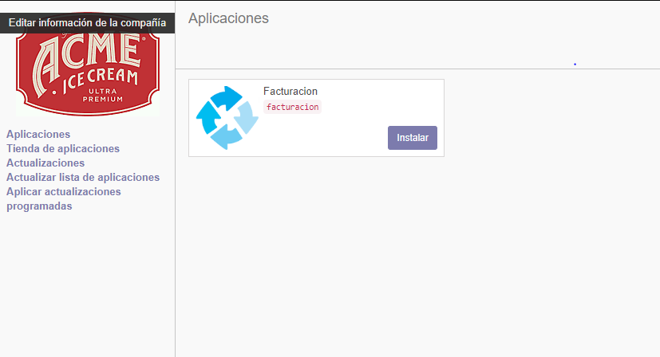
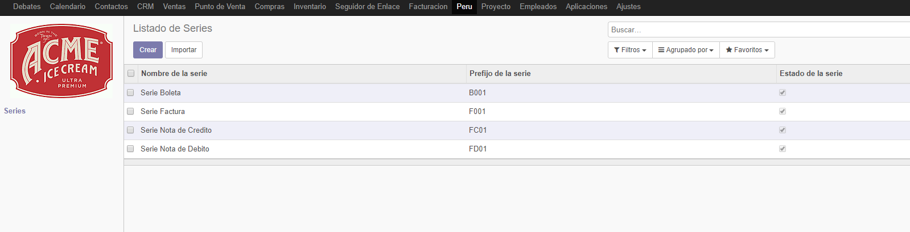
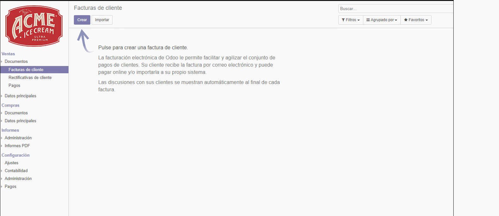
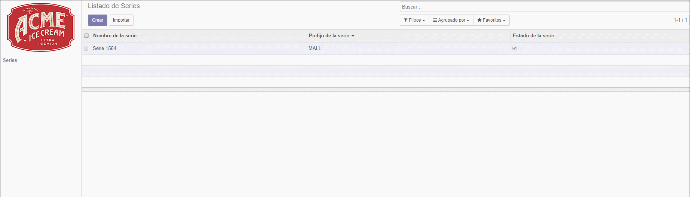
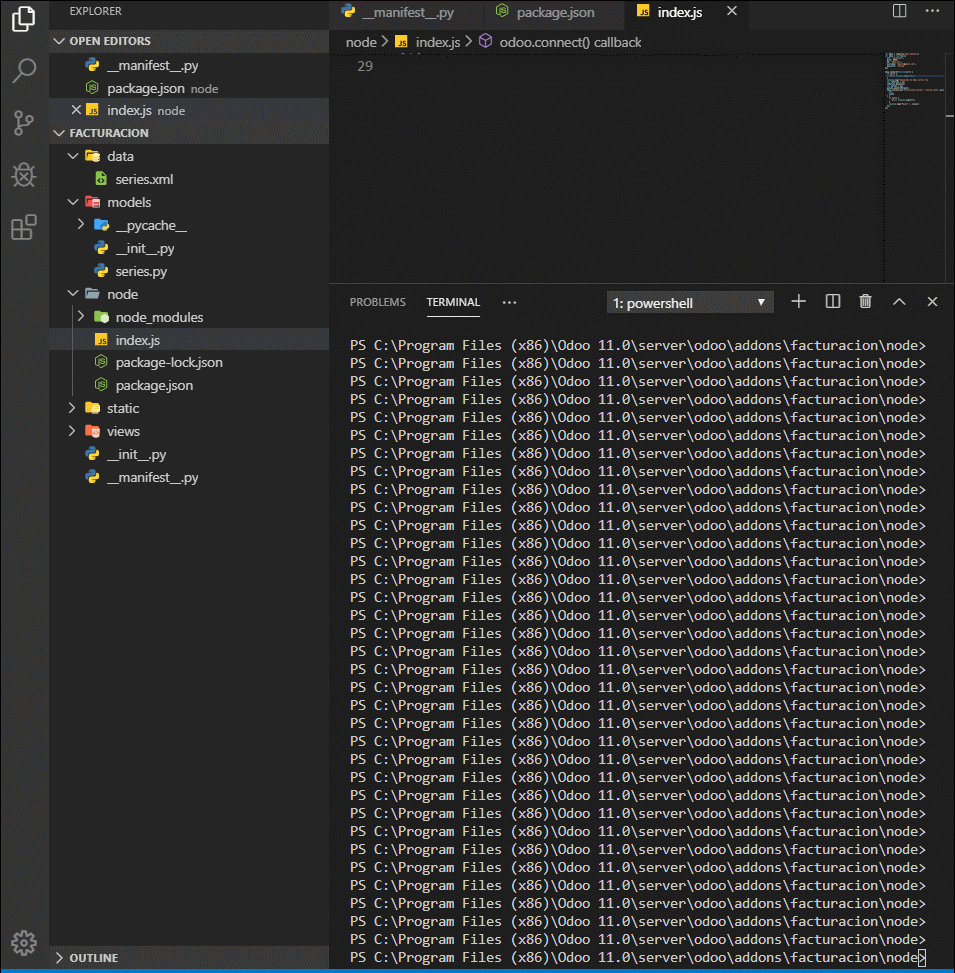

# Lab 9

## Desarrollo

1listado de series

2Agregando un elemento a la lista

3Instalando modulo personalizado o creado

4Mostrando informacion 

5Enlazando la factura 

6Filtrando por prefijo y por nombre de serie

7Implementacion de la API

## Conclusiones

- Aprendimos a crear nuestros modulos propios, comprendimos su estrcutura y como es que se comporta un modulo de Odoo
- Logramos personalizar nuestro modulo ya sea en la descripcion y icono
- Vimos como Odoo trabaja sus interfaces con archivos XML
- Logramos integrar una API para una aplicacion movil
