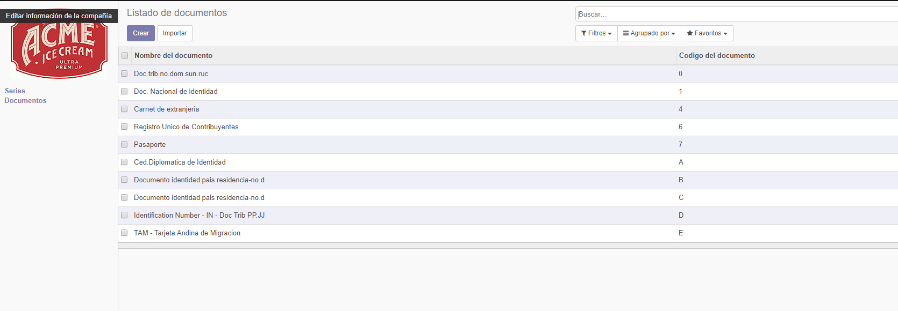
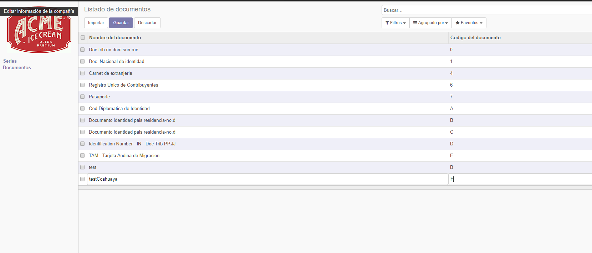
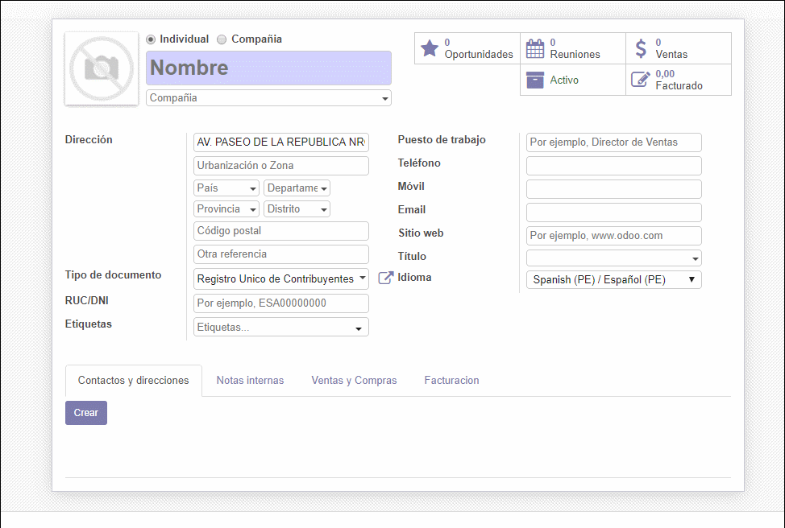
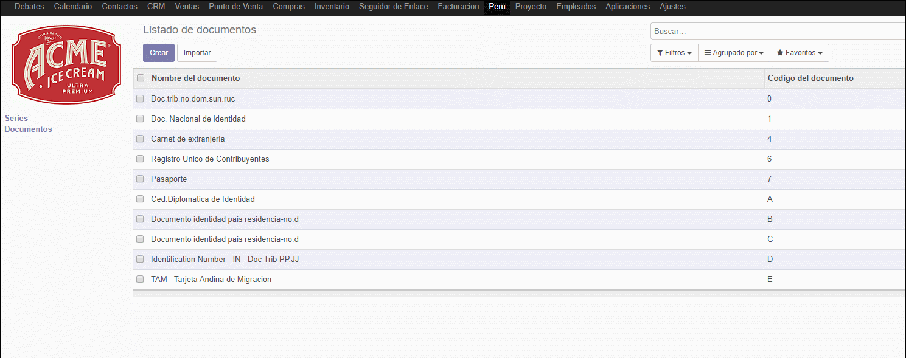
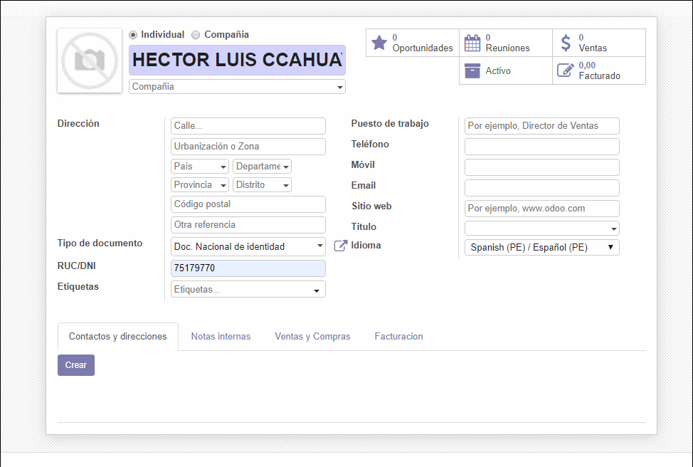
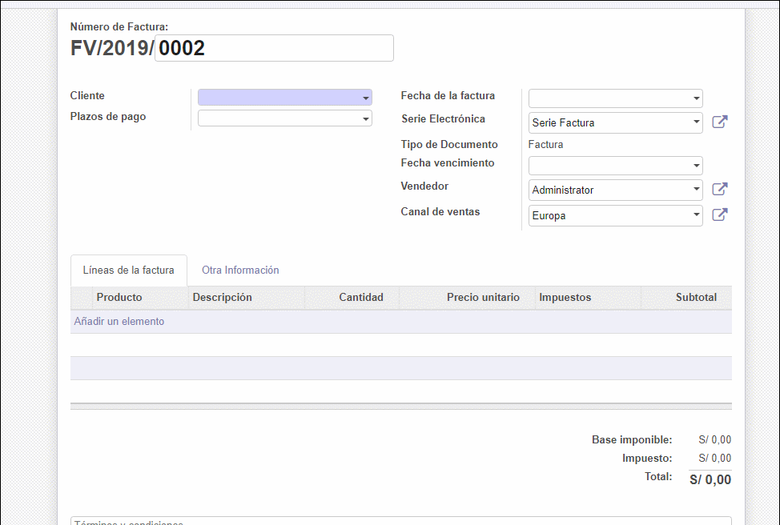

# Lab 10

## Desarrollo

1documentos 

2agregar documento

3Autocompletado de nombre dependiendo del DNI o RUC

4Editando un documento

5Evitando un duplicado de contactos

6Estado los campos relacionados en una factura

## Conclusiones

- Al trabajar con una API nos facilita algunos procesos, pero no debemos depender muhco de servicos fuera de nuestro alcanse.
- Para  obtener la data primeramente necesitamos el token y el url  base , seguidamente ejecutamos la funcion get_doc y validamos si la peticion fue correcta o no.
- Antes de hacer la peticion de la informacion primeramente validamos si es dni o ruc,dependiendo de esto hacemos el filtrado de la data para obtener la data que requerimos.
- El metodo api.constrains nos permitio validar si el contacto que agregaremos no exista, con el metodo search_count la cual valida dependiendo de 3 parametros.

