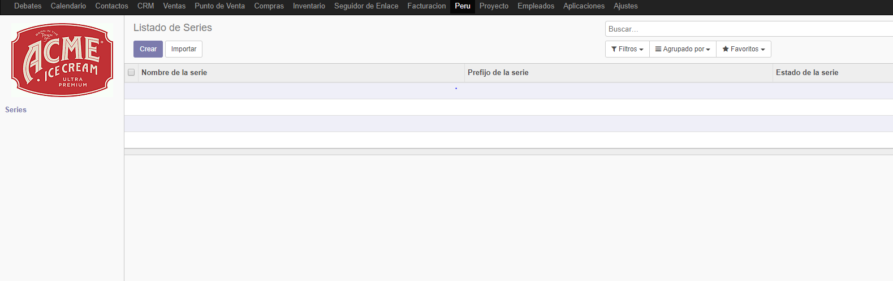
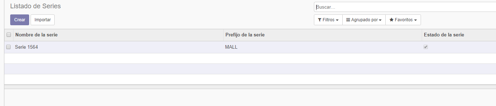
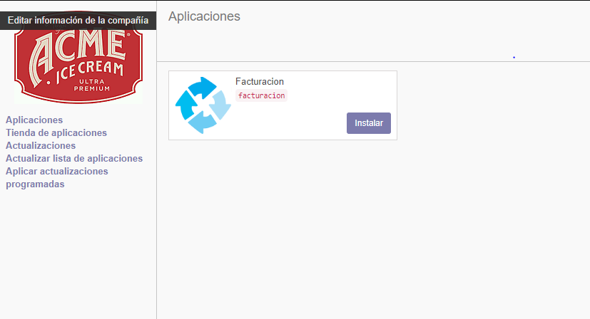
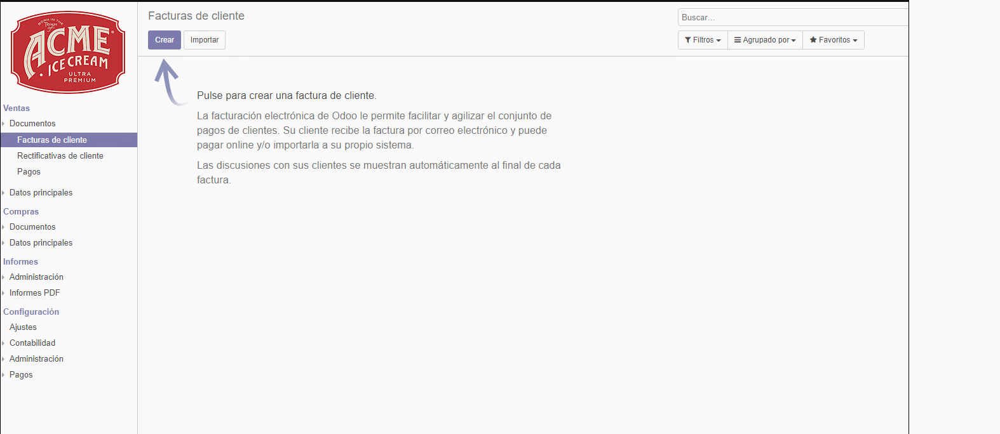
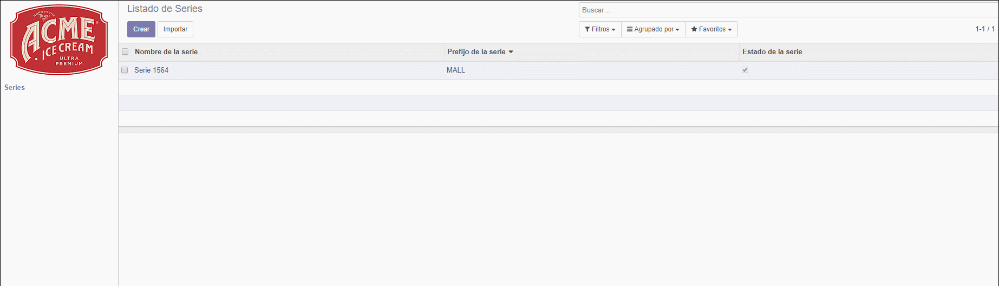
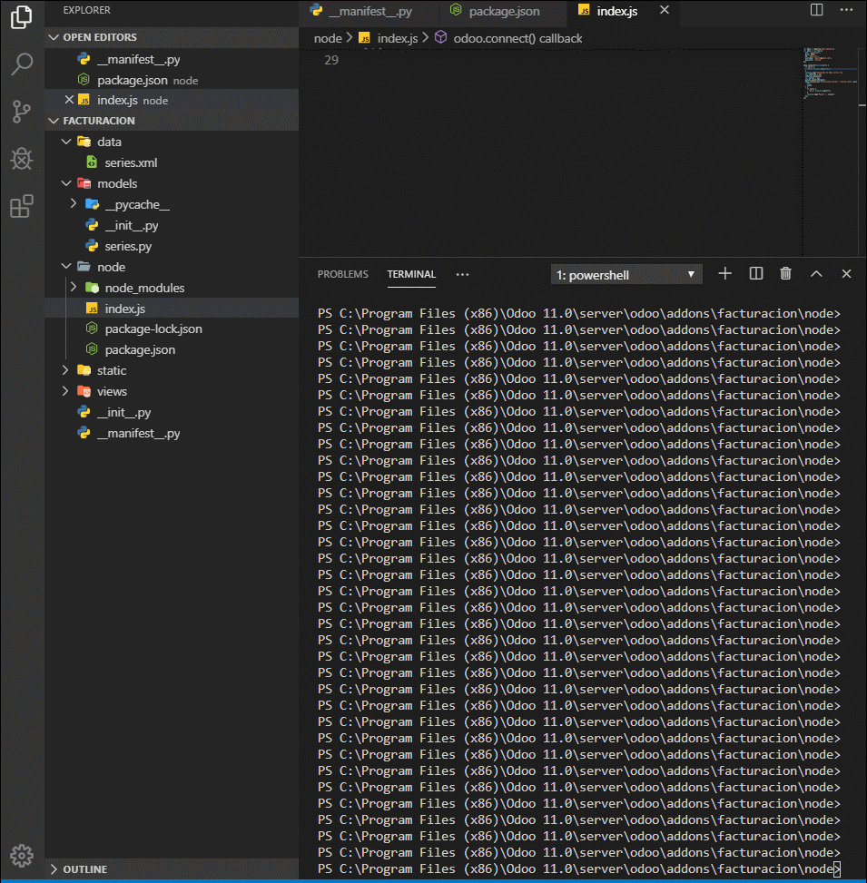

# Lab 9

## Desarrollo

1listado de series

2Agregando un elemento 

3Instalando modulo personalizado

4Mostrando informacion cargada

5Enlazando la factura

6Buscando por prefijo y por nombre de serie

7Integrando Api

## Conclusiones

- Loagramos crear nuestro propio modulo desde cero, logramos ver cual es su estrcutura y como se comporta
- Logramos personalizar nuestro modulo, ya sea en la descripcion como en la imagen
- Observamos que los modulos de Odoo trabajan su interfaz con archivos XML
- Se logro integrar una API , esto es de grana yuda ya que podemos integrarlo con dispositivos moviles

